  

 

## What I work on

I build machine learning systems that end up in front of real users — a telehealth platform, an AR pipeline on Meta Quest, an agri-tech suite I co-founded. Most of my work sits in computer vision, NLP and generative AI, and most of it ships as a product rather than stopping at a notebook.

Based in Karachi. Open to talking about applied CV, agentic systems, and anything at the intersection of AI and agriculture.

 

## Production systems

> End-to-end products I designed and shipped. Source is private, but I'm glad to walk through the architecture or demo them on request.

<table>
<tr>
<td width="50%" valign="top">

### 🏥 MediConnect
Telehealth platform with both scheduled and on-demand consultations, realtime doctor↔patient matching, a shared medical record, and AI features including a photo symptom checker with skin and X-ray disease detection.

`Next.js 16` `TypeScript` `Tailwind` `Supabase`

</td>
<td width="50%" valign="top">

### 💄 Lumi
AI fashion and beauty assistant — a Flutter app on a FastAPI backend. Virtual clothes try-on, hair colour and makeup preview, face contour, skin analysis, shade finder and a Gemini-powered stylist chat, with a saved library of generated looks.

`Flutter` `FastAPI` `YouCam API` `Gemini` `Docker` `Azure Container Apps`

</td>
</tr>
<tr>
<td width="50%" valign="top">

### 🕶️ 3D Mesh Generation for AR
A 3D U-Net pipeline that generates mesh from volumetric data, integrated into a Unity application running on Meta Quest.

`Unity` `C#` `PyTorch` `3D U-Net` `Meta Quest SDK`

</td>
<td width="50%" valign="top">

### 🔐 Identity Secure Verification
Blockchain identity verification with a smart-contract registry, Metamask wallet auth, a Gemini verification assistant and decentralised document storage.

`Solidity` `Hardhat` `Flask` `React` `IPFS`

</td>
</tr>
<tr>
<td colspan="2" valign="top">

### 🌱 Earthrenewal.AI
The full agri-tech product suite — soil and irrigation intelligence for farmers — built and shipped end to end as co-founder. <a href="https://earthrenewal.com">earthrenewal.com</a>

</td>
</tr>
</table>

 

## Public work

| Project | What it does | Stack |
|---|---|---|
| [Flood Segmentation](https://github.com/NizELITe/Flood_Image_Segmentation) | Segments flooded regions in satellite imagery with an Attention U-Net · [notebook](https://www.kaggle.com/code/k214744nizamuldin/unet-flood-segmentation) · [deployed API](https://github.com/NizELITe/Flood-Segmentation-APi-) | PyTorch, FastAPI |
| [Travel with Agentic AI](https://github.com/NizELITe/Travel_with_agentic_AI) | Plans trips and generates itineraries through an agent loop | LangChain, LLM agents |
| [International Flight Agent](https://github.com/NizELITe/International_flight_agent) | Agent that searches and reasons about international flights | Python, agents |
| [MRI Tumor Classification](https://github.com/NizELITe/MRI-Tumor-Classification-Unity) | Classifies tumours from MRI scans | CNNs, PyTorch |
| [Earthrenewal Chatbot](https://github.com/NizELITe/EarthRenewal.AI/tree/main/Chatbot_Earthrenewal) | Answers farmer questions on soil and irrigation in regional languages | LangChain, FAISS |
| [Construction Safety Detection](https://github.com/NizELITe/Construction_safety) | Real-time detection of helmets, vests and safety gear on site | YOLO, OpenCV |
| [Clinic Report Summarizer](https://github.com/NizELITe/clinic_report_summarizer) | Extracts and summarises medical reports into readable text | NLP, transformers |
| [Azure Computer Vision](https://github.com/NizELITe/Azure_ComputerVision) · [Azure AI Chatbot](https://github.com/NizELITe/Chatbot_Azure_AI) | Cloud vision and conversational AI services | Azure AI |
| [Image Generation with GANs](https://github.com/NizELITe/Image-Generation-with-GANS) | GAN experiments in image synthesis | PyTorch |
| [Pose Estimation](https://github.com/NizELITe/Pose_estimation) | Human pose estimation from video | MediaPipe, OpenCV |

Practice and coursework repositories

 

- [Computer Vision](https://github.com/NizELITe/Computer-vision) — OpenCV and CNN experiments
- [NLP](https://github.com/NizELITe/NLP) — text processing, embeddings, transformers
- [Generative AI](https://github.com/NizELITe/Generative-AI) — GenAI projects and practice
- [Recommendation Systems](https://github.com/NizELITe/Recommendation-Systems)
- [Automated Article Scrapper](https://github.com/NizELITe/Automated-Article-Scrapper)
- [Voice & Text Communication](https://github.com/NizELITe/voice-and-text-communication-project)
- [English → Urdu Translation](https://github.com/NizELITe/Eng_to_urdu_translation)
- [ML on Research Papers](https://github.com/NizELITe/MLonResearchpapers)
- [Logic Programming in Prolog](https://github.com/NizELITe/Logic-Programming-prolog-)

 

## Tools

**Languages**  

**AI and vision**  

**Product**  

**Infrastructure**  

 

## Activity

<picture>
  <source media="(prefers-color-scheme: dark)" srcset="https://raw.githubusercontent.com/NizELITe/NizELITe/output/snake-dark.svg" />
  <source media="(prefers-color-scheme: light)" srcset="https://raw.githubusercontent.com/NizELITe/NizELITe/output/snake-light.svg" />
  
</picture>

